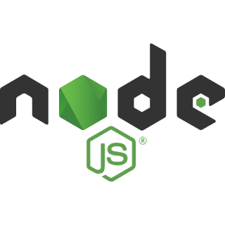
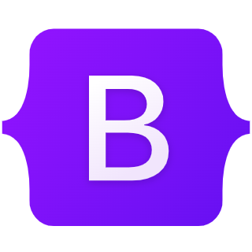
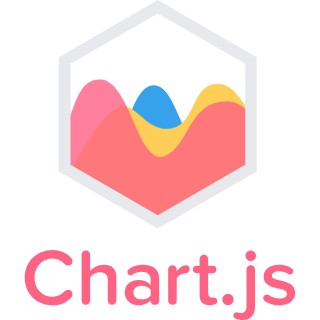
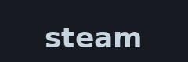
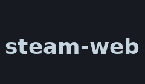
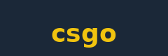

🚀 Aplicación web diseñada para capturar, visualizar y almacenar datos en tiempo real del videojuego **Counter-Strike: Global Offensive** (CS:GO), con el objetivo de apoyar la mejora continua del jugador mediante el análisis de métricas.

🎮 Utilizando la funcionalidad **Game State Integration** (GSI),un archivo de texto almacenado en la carpeta del juego, el sistema recibe eventos en tiempo real con información básica del estado de la partida, tales como:

- 🧍 estado del jugador (vivo,muerto,desconectado)
- 🕹️ número de rondas 
- 💵 recursos
- 📈 equipo ganador y perdedor 
- 🗡️ armas equipadas 

🧩 Para acceder a estadísticas más profundas, se emplea paquetes de terceros (NPM) que permite recuperar:
- 🧑 Perfil público de steam del jugador
- 📊 Estadísticas globales del jugador (mapas más jugados, armas favoritas, KDA, etc.)
- 📂 Análisis profundo de replays (`.dem`) para obtener:
  - 🔎 Coordenadas de cada jugador
  - 🔫 Seguimiento de asesinatos por ronda
  - 📋 Eventos detallados (quién mató a quién, con qué arma y en qué momento)

# ⚙️ Stack tecnológico
A continuación se detallan las principales tecnologías empleadas en el desarrollo del sistema, tanto para la recolección de datos como para la visualización y almacenamiento:

## 🔧 Back-End

  
     Node.js
  &nbsp;&nbsp;&nbsp;&nbsp;
  
     MongoDB
  &nbsp;&nbsp;&nbsp;&nbsp;
  
     Express.js
  &nbsp;&nbsp;&nbsp;&nbsp;
   

## 🎨 Front-end

  
     Bootstrap
  &nbsp;&nbsp;&nbsp;&nbsp;
  
  &nbsp;&nbsp;&nbsp;&nbsp;
   <a href="https://www.npmjs.com/package/ejs">
  
    
  &nbsp;&nbsp;&nbsp;&nbsp;
  

  
## 📦 NPM
 

  
     Passport
  &nbsp;&nbsp;&nbsp;&nbsp;
  <a href="https://www.npmjs.com/package/steam">
  
  &nbsp;&nbsp;&nbsp;&nbsp;
  <a href="https://www.npmjs.com/package/steam-web">
  
  &nbsp;&nbsp;&nbsp;&nbsp;
  <a href="https://www.npmjs.com/package/csgo">
  
  &nbsp;&nbsp;&nbsp;&nbsp;
  
 

